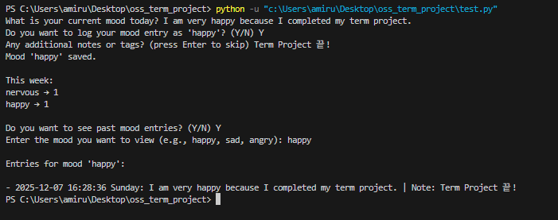

# MoodIG - Mood 일기 (Personal Mood Journal)

## Contents
- [Title / Project Introduction](#1-title--project-introduction) :open_book:
- [Developer Information](#2-developer-information) :technologist:
- [Uniqueness](#3-uniqueness) :sparkles:
- [Development Stack](#4-development-stack) :hammer_and_wrench:
- [Running the Program](#5-running-the-program) :grin:
- [Code Description](#6-code-description) :computer::mag_right:
- [Image](#7-image) :framed_picture:
- [Information / Sources / Reference](#8-information--sources--reference) :link:
- [Acknowledgements](#9-acknowledgements) :handshake:
- [Future Improvements](#10-future-improvements) :thought_balloon:
- [License](#11-license) :bookmark_tabs:


## 1. Title / Project Introduction :open_book:
**MoodIG - Mood 일기** is a program designed to **track and record users' emotions** daily. Additionally, this app helps users to understand themselves better and serve as a personal record of their life journey. The program detects the user's emotion **from sentences** they input and stores the entries given with timestamps and optional notes. 


## 2. Developer Information :technologist:
**Iqmal Nur Hazeeq (25101184_이크말)**


## 3. Uniqueness :sparkles:
Unlike traditional diaries and diary apps, this program can:

* Predict mood based on **users’ input sentences** using a combination of _keyword-based analysis_ and _machine learning_, rather than **selecting pre-defined options**.

* Provides **weekly summaries** to help users track their changes in emotions over time.

* Stores past entries in a **filterable list**, allowing them to reflect on why they felt that way

* Serves as a **personal journey record**, transforming daily entries into meaningful memories about oneself.

In short, this program is not just a mood tracker; it’s a tool for self-awareness and personal growth.


## 4. Development Stack :hammer_and_wrench:
Python 3.10 and scikit-learn 1.3.2


## 5. Running the Program! :grin:
1. Download Python 3.10
2. Install required libraries
    ```shell
    pip install scikit-learn==1.3.2
    ```
3. Open your terminal/command prompt
4. Navigate your way to the program folder
    ```shell
    python test.py
    ```
5. The prompts are as below:
    * enter your mood as a sentence
    * confirm your predicted mood
    * add any optional tags
    * log the entries 
    * (optional) view past entries using the filterable list


## 6. Code Description :computer::mag_right:
1. **mood_grouping**
    - a dictionary to store lists of keywords related to certain moods
    - enables the functionality of keyword-based analysis when reading users' sentences
    - important to allow the program to predict the emotion from the sentences
    - helps to resolve ties prediction

2. **def sentence_checker(sentence)**
    - check the sentence in advance and change them into normalized and cleaned sentences
    - ensures both keyword-based analysis and machine learning model work correctly
    - important for word matching, allowing accurate emotion analysis

3.  **training_text = [], training_mood = []**
    - store training data for the machine learning model
    - training_text contains the sentences; training_mood contains the corresponding moods
    - Decision Tree Classifier was chosen because it matches the developer's current level of understanding
    - the classifier learns the relationship between sentences and moods, allowing mood predictions
    - reads from training_data.txt file

4. **with open("training_data.txt", "r", encoding="utf-8") as f**
    - reads the training_data.txt files and prepare it for the machine learning model
    - similar to the code in lecture slides, it ignores empty lines and comments (#)
    - split sentences separated by commas into sentence and mood labels, and add them to the lists
    - helps classifier to collects labeled data and predicts mood

5. **vocab = [], for group in mood_grouping.values(), and vocab = list(set(vocab))**
    - creates a vocabulary lists from all mood keywords, which will be used later to convert sentences into features
    - start with empty list, iterate and added all words, remove duplicates with set()
    - the basis for extraction, which is important for accurate mood prediction

6. **def text_to_features(text)**
    - convert sentences into feature vector for machine learning 
    - each sentence becomes a numerical representation: 1 present 0 not

7. **X_train = [text_to_features(t) for t in training_text], y_train = training_mood**
    - X_train contains feature vectors; y_train contains corresponding mood labels
    - both of them form training dataset for the machine learning
    - classifier uses this dataset to learn the relationships between sentences and moods

8. **from sklearn.tree import DecisionTreeClassifier, model = DecisionTreeClassifier(random_state=42), model.fit(X_train, y_train)**
    - import and initialize the Decision Tree classifier
    - model.fit() train classifier on the dataset
    - the model now can predict the mood of new sentences based on the patterns

9. **def mood_counter(text)**
    - count the mood keywords in sentences, and increments the counter for corresponding mood
    - handle single-word and multiple-word keywords
    - determine predominant emotion in the sentence provided

10. **def predicting_current_mood(text)**
    - uses the trained machine learning and keyword-based analysis to predict current mood
    - convert input sentences into feature vectors
    - uses mood_counter() to help determine the final predicted mood

11. **def weekly_update()**
    - calculate a summary moods for the current week based on mood_log.txt
    - save and prints weekly summary to weekly_summary.txt
    - help users to track their mood patterns over time

12. **def filter_by_mood(mood_to_filter)**
    - filters and displays past mood entries from mood_log.txt that matched selected moods
    - print the entries in a list format showing date, sentence, and optional notes
    - allows the user to reflect on why they felt a certain way

13. **def view_mood_log()**
    - provide an interactive way for the user to view past mood entries
    - display entries in a list format through filter_by_mood(mood_to_filter)
    - helps users to review and reflect on their changes in mood

14. **if __name__ == "__main__"**
    - entry point of the program
    - handles user interaction such as asking, predicting, confirming and saving current mood
    - ensures the program run smoothly as a complete program

## 7. Image :framed_picture:




## 8. Information / Sources / Reference :link:
[Repository Template 1](https://github.com/lej8924/oss_project.git) - used as README.md template
[Repository Template 2](https://github.com/ha4219/term-project.git) - used as README.md template
[Python Emoji Template](https://github.com/ikatyang/emoji-cheat-sheet/blob/master/README.md) - reference emoji in Python
[Inspiration](https://daylio.net/) - inspired mood tracking ideas

## 9. Acknowledgements :handshake:

This project was developed by me, **Iqmal Nur Hazeeq**, using my own level understanding of Python code. I also used **ChatGPT** to assist with ideas and guidance on coding structure, explanations, and debugging. All implementations were written by me, and suggestions from ChatGPT were adapted to my level and understanding.


## 10. Future Improvements :thought_balloon:
1. **Implement a GUI**
- current program is using terminal/command prompt, so it looks very boring and basic
- can implement python based GUI such as tkinter

2. **Provide Interesting Recommendations**
- Adding, confirming and saving might probably simple
- can implement various type of suggestion such as food, music or interesting facts

3. **Data Visualization**
- Having too much log at once may be overwhelming to some people
- can implement graph or chart for better visualization  

## 11. License :bookmark_tabs:
This project is licensed under the MIT License

MIT License

Copyright (c) 2025 kyuumall

Permission is hereby granted, free of charge, to any person obtaining a copy
of this software and associated documentation files (the "Software"), to deal
in the Software without restriction, including without limitation the rights
to use, copy, modify, merge, publish, distribute, sublicense, and/or sell
copies of the Software, and to permit persons to whom the Software is
furnished to do so, subject to the following conditions:

The above copyright notice and this permission notice shall be included in all
copies or substantial portions of the Software.

THE SOFTWARE IS PROVIDED "AS IS", WITHOUT WARRANTY OF ANY KIND, EXPRESS OR
IMPLIED, INCLUDING BUT NOT LIMITED TO THE WARRANTIES OF MERCHANTABILITY,
FITNESS FOR A PARTICULAR PURPOSE AND NONINFRINGEMENT. IN NO EVENT SHALL THE
AUTHORS OR COPYRIGHT HOLDERS BE LIABLE FOR ANY CLAIM, DAMAGES OR OTHER
LIABILITY, WHETHER IN AN ACTION OF CONTRACT, TORT OR OTHERWISE, ARISING FROM,
OUT OF OR IN CONNECTION WITH THE SOFTWARE OR THE USE OR OTHER DEALINGS IN THE
SOFTWARE.